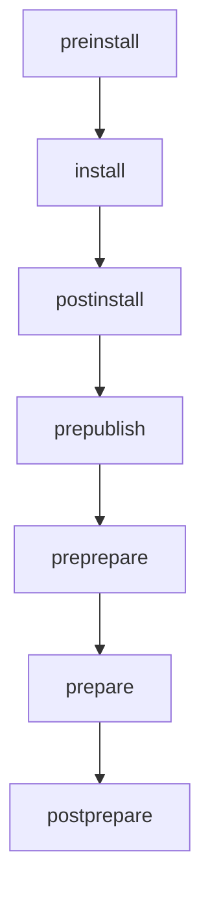
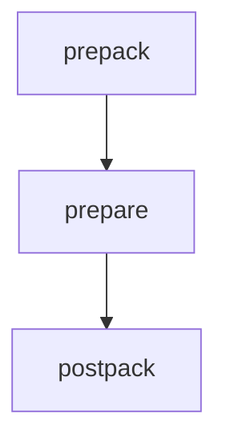
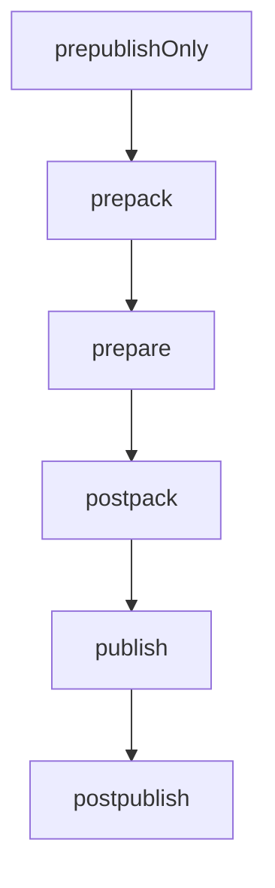
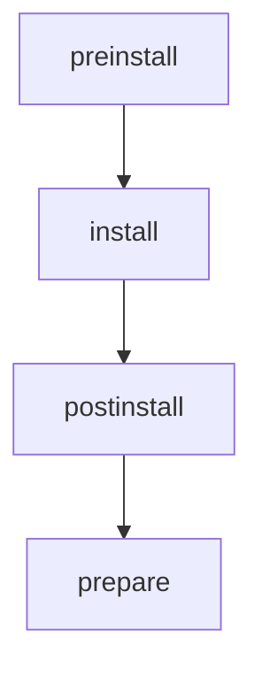
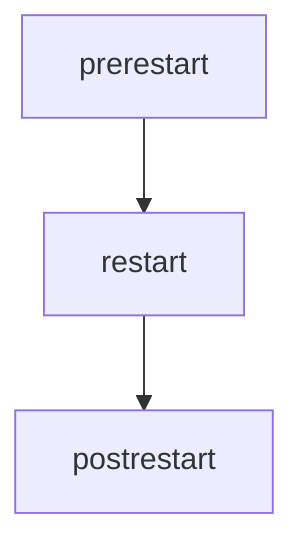
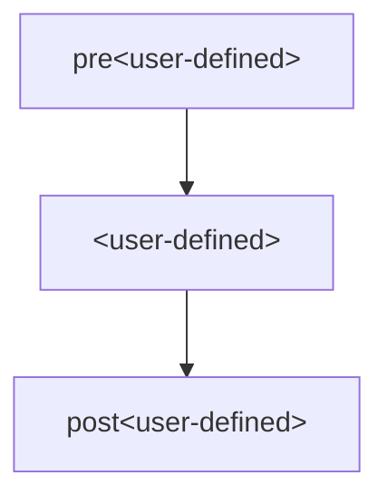
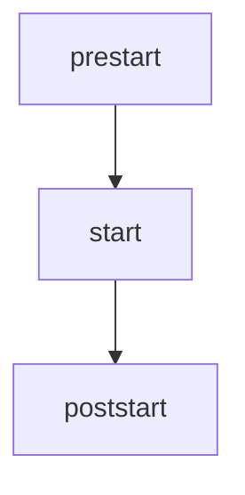
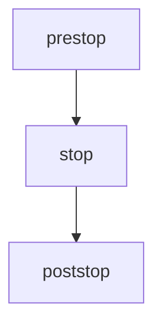
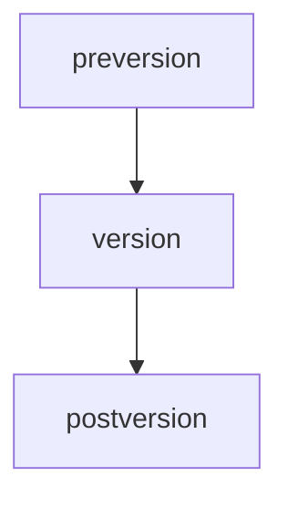

# NPM的使用

本项目主要是npm packages的使用

## 工作区

npm install的包名如果存在在工作区中，会在node_modules中添加一个软链接到工作区（注意包名不是目录，而是package.json中定义的name）

给工作区添加的依赖都会在项目的根目录的node_modules中

### 对于npm

添加一个工作区
```bash
npm init -w ./packages/hello -y
```

给工作区hello添加依赖项：lodash
```bash
npm install lodash -w hello
```

给工作区hello删除依赖项：lodash
```bash
npm uninstall lodash -w hello
```

给工作区hello更新依赖
```bash
npm update lodash -w hello
```

运行工作区hello的命令
```bash
npm run dev -w hello
```

运行所有工作区的命令
```bash
npm run dev --workspaces
```
运行所有工作区的命令（有才运行）
```bash
npm run dev --workspaces --if-present
```

### 对于yarn

列举工作区信息
```bash
yarn workspaces info
```

添加依赖
```bash
yarn workspace hello add lodash
```

为所有包添加一个共同的依赖项
```bash
yarn add lodash -W -D
```

hoist依赖提升，默认给子包添加的依赖会提升到根目录中；如果想要在子包中安装，需要配置：（npm没有该配置）
```json
{
    "workspaces": {
        "packages": [
            "packages/*"
        ],
        "nohoist": ["**/docs", "**/docs/**"]
    }
}
```

运行工作区脚本
```bash
yarn workspace hello dev
```

## 脚本

位于package.json的scripts属性的配置，使用：  
`npm run <stage>`或`npm run-script <stage>`

执行依赖项中脚本
```bash
npm explore <pkg> -- npm run <stage>
```

### pre和post脚本

可以为任意脚本添加pre和post脚本
```json
{
  "scripts": {
    "precompress": "{{ executes BEFORE the `compress` script }}",
    "compress": "{{ run command to compress files }}",
    "postcompress": "{{ executes AFTER `compress` script }}"
  }
}
```

`npm run compress`将会先执行pre然后执行compress，然后执行postcompress

### 生命周期脚本

- prepare
- prepublish
- prepublishOnly
- prepack
- postpack
- dependencies

执行`npm cache add`


执行`npm ci`


执行`npm diff`


执行`npm install`


执行`npm pack`


执行`npm publish`


执行`npm rebuild`


执行`npm restart`


执行`npm run xxx`（用户自定义）


执行`npm start`


执行`npm stop`


执行`npm version`


